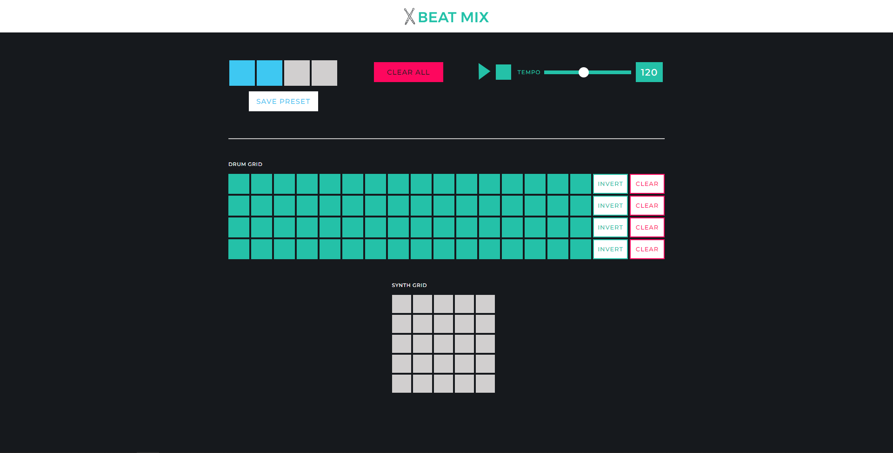
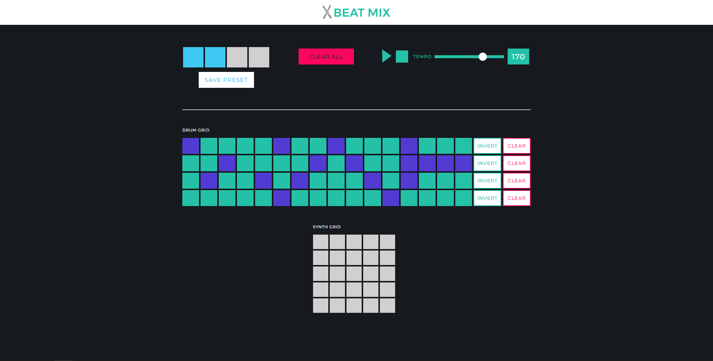

# Beat Mix

A project from Codecademy: [Create a Back-End App with JavaScript](https://www.codecademy.com/learn/paths/create-a-back-end-app-with-javascript) skill path.

## Project Overview

A beat-making music machine which loop over a 16-step grid of four drum types and play them when they are activated. 

## Screenshots

  

## Setup

- Install dependencies
`npm install`

- Run the server
`npm run start`

- Open `index.html` file

